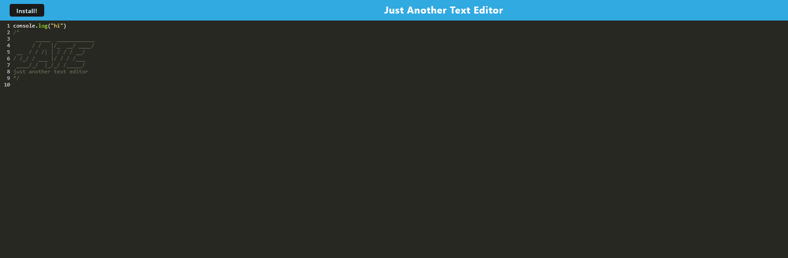

## SIMPLE TEXT EDITOR

This project is a text editor web application built to allow users to create and store notes or code snippets with or without an internet connection. It meets the criteria of a Progressive Web Application (PWA) and features data persistence techniques using IndexedDB, offline functionality, and deployment to Render.

# Features
- Create and store notes or code snippets
- Offline functionality with IndexedDB data persistence
- Service worker for caching static assets
- Bundled with Webpack and uses Babel for next-gen JavaScript support
- Automatically saves content inside the text editor when the DOM window is unfocused
- Can be installed as a Progressive Web Application
- Deployed to Render with proper build scripts

# Getting Started
To run the application locally, follow these steps:

1. Clone the repository:

<code>git clone <repository-url></code.>

2. Navigate to the project directory:

<code>cd text-editor-pwa</code>

3. Install dependencies:

<code>npm install</code>

4. Start the development server:

<code>npm run start</code>

5. Open your browser and navigate to http://localhost:3000 to view the application.

# Technologies Used
- HTML5
- CSS3
- JavaScript
- IndexedDB
- Webpack
- Babel
- Render (for deployment)

# Deployment

The application is deployed on Render and can be accessed at Live Demo.

# Screenshots
